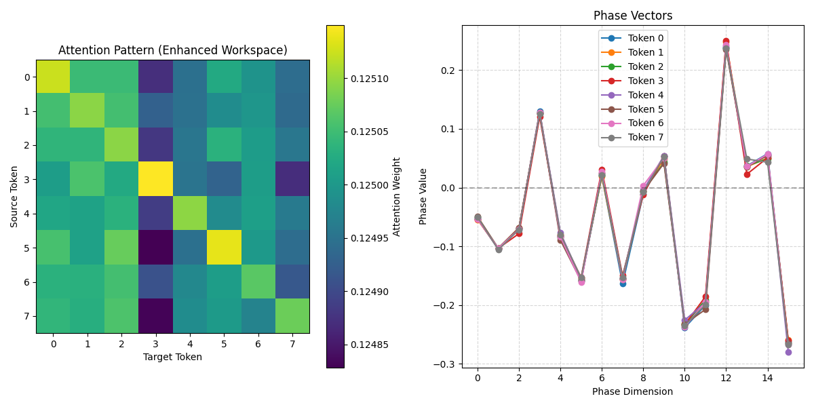
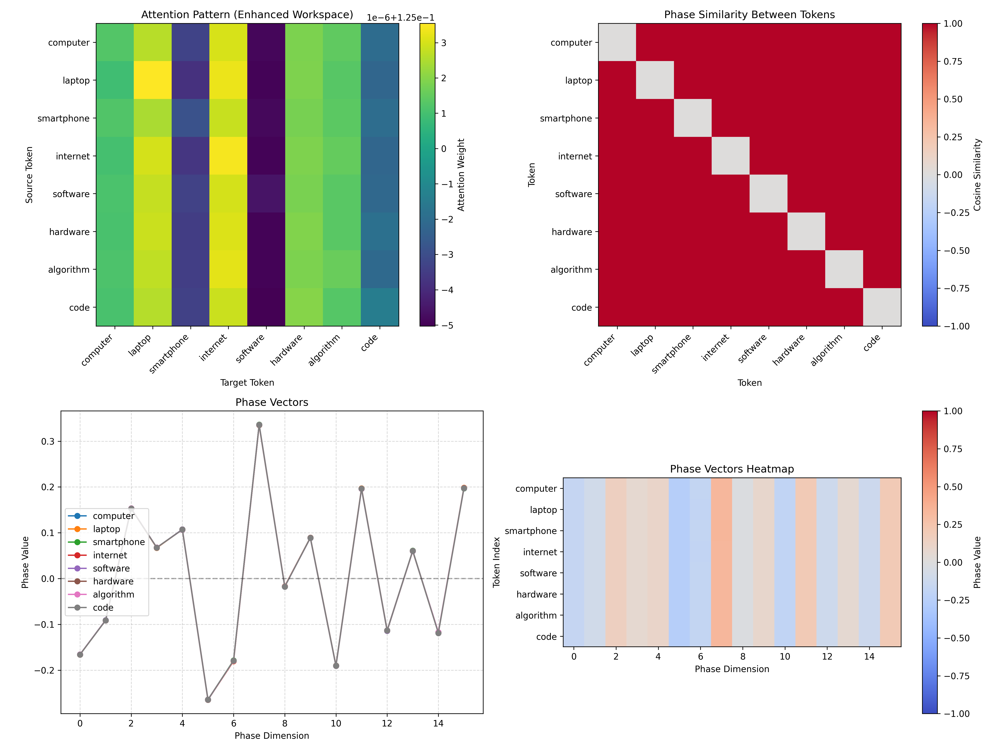

# Synthetic Thalamus- work in progress

A neural attention mechanism inspired by the biological thalamus for information filtering and task-modulated processing.

## Overview

The Synthetic Thalamus is a novel neural network module designed to selectively filter and gate information flow in a computational graph, similar to how the biological thalamus acts as a relay station in the brain. This repository implements a PyTorch-based Synthetic Thalamus with the following key features:

- **Salience-based token gating** using multihead attention
- **Task conditioning** to modulate attention patterns based on the current task
- **Phase-aware processing** through learned rotary-like embeddings
- **Modality adapters** for different input types (image, text)
- **Feedback integration** for salience adjustments based on rewards

## Architecture

The Synthetic Thalamus acts as an information bottleneck and attention mechanism. It:

1. Takes a sequence of token features as input
2. Scores each token's salience using multi-head attention, conditioned on a task embedding
3. Selects the top-K most salient tokens
4. Generates phase tags for each token to encode sequential/temporal information
5. Outputs the gated tokens with their phase tags for further processing

This approach is inspired by Global Workspace Theory and the way the biological thalamus selectively relays information to the cortex based on attentional priorities.

### Enhanced Workspace with Phase Similarity Attention

The project includes an enhanced workspace implementation that leverages the phase tags more effectively:

- **Phase Similarity Attention Bias**: The attention mechanism is biased to favor tokens with similar phase signatures
- **Learnable Phase Scale**: The influence of phase similarity on attention is controlled by a learnable parameter
- **Multi-layer Processing**: Multiple transformer layers with phase-aware attention for deeper processing
- **Biological Inspiration**: Mimics neural oscillations in the thalamus that are thought to coordinate cortical processing

This enhanced workspace better utilizes the phase information, enabling:

- **Temporal Binding**: Helping the model determine which tokens should be processed together
- **Rhythmic Synchronization**: Acting as a "clock" signal that allows the workspace to align information streams
- **Feature Grouping**: Guiding the workspace to emphasize tokens that are in phase with each other

## Repository Structure

```plaintext
synth_thalamus/
├── core/
│   ├── __init__.py
│   ├── thalamus.py       # SyntheticThalamus module
│   ├── adapters.py       # Modality-specific encoders
│   └── feedback.py       # Feedback layer for salience adjustments
├── examples/
│   ├── image_clf.ipynb   # Demo for image classification
│   └── babi_qa.ipynb     # Demo for question answering tasks
├── tests/
│   ├── test_gating.py    # Unit tests for top-K gating
│   └── test_phase.py     # Unit tests for phase generation
├── train.py              # LightningModule-based training entrypoint
└── README.md             # This file
```

## Installation

### Installing Dependencies

Once your virtual environment is activated, install the dependencies:

```bash
# Clone the repository
git clone https://github.com/angrysky56/synth_thalamus.git
cd synth_thalamus
```

It's recommended to use a virtual environment to avoid conflicts with other projects:

```bash
# Install virtualenv if you don't have it already
pip install virtualenv
```

### Python Version

This project is designed to work with Python 3.11 or newer. As of April 2025, Python 3.13 is the latest stable version (with Python 3.13.3 released on
April 8, 2025), but Python 3.11 and 3.12 are also well-supported and have excellent compatibility with machine learning libraries including enhanced performance optimizations that improve dictionary operations, memory management, and list handling.

```bash
# Create a virtual environment
python3.12 -m venv venv  # You can also use python3.11 or python3.13 if available
```

```bash
# Activate the virtual environment
# On Linux/Mac:
source venv/bin/activate
```

```bash
# On Windows:
venv\Scripts\activate
```

```bash
# Install dependencies
pip install -r requirements.txt
```

### Dependencies

- PyTorch (>=1.10.0)
- PyTorch Lightning (>=1.5.0)
- torchvision (for image examples)
- matplotlib (for visualization)
- numpy (>=1.20.0)

## Quick Start

A minimal example of using the Synthetic Thalamus:

```python
import torch
from core.thalamus import SyntheticThalamus
from core.enhanced_workspace import EnhancedWorkspace

# Initialize the thalamus
thalamus = SyntheticThalamus(
    d_model=128,    # Token feature dimension
    n_heads=4,      # Number of attention heads
    k=16,           # Number of tokens to gate through
    phase_dim=16,   # Dimensionality of phase tags
    task_dim=64,    # Dimensionality of task conditioning
    num_tasks=10    # Number of distinct tasks
)

# Initialize the enhanced workspace
workspace = EnhancedWorkspace(
    input_dim=128,       # Content dimension (without phase)
    hidden_dim=256,      # Hidden dimension for feed-forward layers
    output_dim=10,       # Output dimension (e.g., number of classes)
    nhead=4,             # Number of attention heads
    phase_dim=16,        # Dimensionality of phase tags
    num_layers=2         # Number of transformer layers
)

# Example input: batch of 4 sequences, each with 100 tokens of dimension 128
tokens = torch.randn(4, 100, 128)
task_ids = torch.tensor([0, 1, 0, 2])  # Different tasks per batch item

# Forward pass through thalamus
gated_tokens = thalamus(tokens, task_ids)
print(gated_tokens.shape)  # Output: [4, 16, 144] (batch_size, k, d_model + phase_dim)

# Forward pass through workspace
output, pooled = workspace(gated_tokens)
print(output.shape)     # Output: [4, 10] (batch_size, output_dim)
print(pooled.shape)     # Output: [4, 128] (batch_size, d_model)

# Access attention weights for visualization
attention_weights = workspace.attention_weights
```

You can also use the demo script to visualize the phase similarity attention:

```bash
python examples/phase_similarity_demo.py
```

## Training

You can train a model with the Synthetic Thalamus using the provided PyTorch Lightning module:

```bash
# Train with the standard workspace
python train.py --max_epochs=10 --gpus=1

# Train with the enhanced workspace (phase similarity attention)
python train.py --max_epochs=10 --gpus=1 --enhanced_workspace
```

The enhanced workspace leverages phase similarity to bias attention, potentially leading to better performance on tasks that require temporal binding or feature grouping.

## Examples

### Image Classification

The `examples/image_clf.ipynb` notebook demonstrates using the Synthetic Thalamus for image classification tasks. It:

1. Processes images into patch tokens
2. Uses the thalamus to select the most salient patches
3. Applies phase embeddings for spatial encoding
4. Feeds the gated tokens to a simple classifier

### Question Answering

The `examples/babi_qa.ipynb` notebook shows the Synthetic Thalamus applied to bAbI question answering tasks. It:

1. Encodes story tokens using a bidirectional LSTM
2. Uses the question as context for the thalamus
3. Gates the most relevant story tokens based on the question
4. Processes the gated tokens with a transformer workspace

## Customization

The Synthetic Thalamus can be customized in several ways:

- **Adjust the bottleneck**: Change `k` to control how many tokens pass through
- **Task conditioning**: Use different task embeddings to change attention patterns
- **Phase embeddings**: Modify phase dimensions to encode different temporal patterns
- **Scoring mechanism**: Replace the default attention-based scorer with custom logic

## Applications

The Synthetic Thalamus is particularly well-suited for:

- **Multi-task learning**: Sharing parameters while maintaining task-specific processing
- **Efficient computation**: Focusing resources on the most salient tokens
- **Modular systems**: Building components that communicate through a shared workspace
- **Attention-driven processing**: Implementing dynamic, priority-based information flow

## Testing

Run the unit tests to verify functionality:

```bash
cd tests
python test_gating.py
python test_phase.py
python test_phase_attention.py

```

The `test_phase_attention.py` test verifies that the phase similarity attention bias works as expected, showing how tokens with similar phase values attend more strongly to each other.


### Demo-Phase Similarity Attention

To visualize how the phase similarity attention works, run the demo script:

```bash
python examples/phase_similarity_demo.py
```

This will generate visualizations comparing standard and enhanced workspace attention patterns, showing how the phase tags influence attention in the enhanced workspace.



```bash
pip3 install ollama

python examples/ollama_phase_demo.py
```



## Future Work

The current implementation serves as a foundation for exploring thalamic-inspired neural architectures. Future enhancements may include:

- Integration with reinforcement learning for adaptive salience adjustment
- Hierarchical thalamus-like structures with multiple bottlenecks
- More sophisticated phase encoding for recurrent processing
- Cross-modal gating for multi-modal tasks

## Inspiration

This project was inspired by recent neuroscience research on the role of the thalamus in consciousness. Specifically, the work draws on findings from an April 2025 study by Zepeng Fang and colleagues published in Science, which discovered that specific thalamic regions (especially the intralaminar nuclei) act as a "gateway" to awareness by synchronizing with the prefrontal cortex. This research challenges traditional cortex-focused views of consciousness and highlights the thalamus as a crucial component in conscious perception.

The synthetic thalamus implemented here attempts to computationally model some aspects of this biological gating mechanism, particularly the synchronization patterns (implemented as phase tags) that appear to be critical for information to reach conscious awareness.

Reference:

“[Human high-order thalamic nuclei gate conscious perception through the thalamofrontal loop](https://pubmed.ncbi.nlm.nih.gov/40179184/)”

by Zepeng Fang, Yuanyuan Dang, An’an Ping, Chenyu Wang, Qianchuan Zhao, Hulin Zhao, Xiaoli Li and Mingsha Zhang, 4 April 2025, Science.

## Credits & Acknowledgements

This implementation was created by:

- **angrysky56** (Ty) - Project lead and concept
- **Claude** (Anthropic) - Implementation and code development
- **ChatGPT** (OpenAI) - Additional assistance and contributions
- **Gemini** (Google) - Additional assistance and contributions

The project draws on theories of cognitive neuroscience, particularly the role of the thalamus in attention and consciousness, as well as Global Workspace Theory which proposes that consciousness emerges from the global broadcasting of information across specialized brain modules.

## License

MIT
